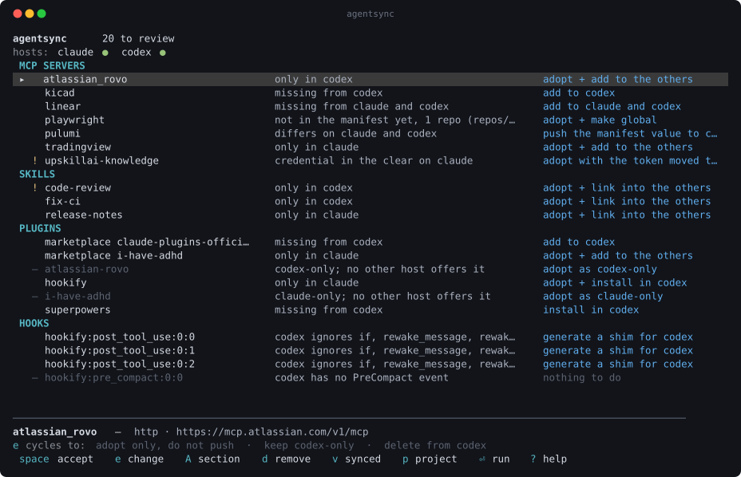
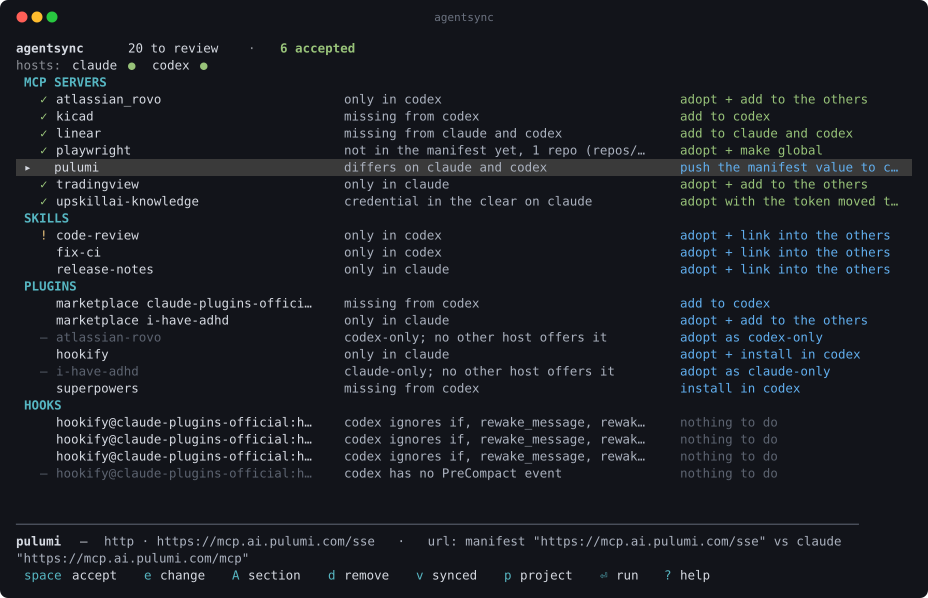
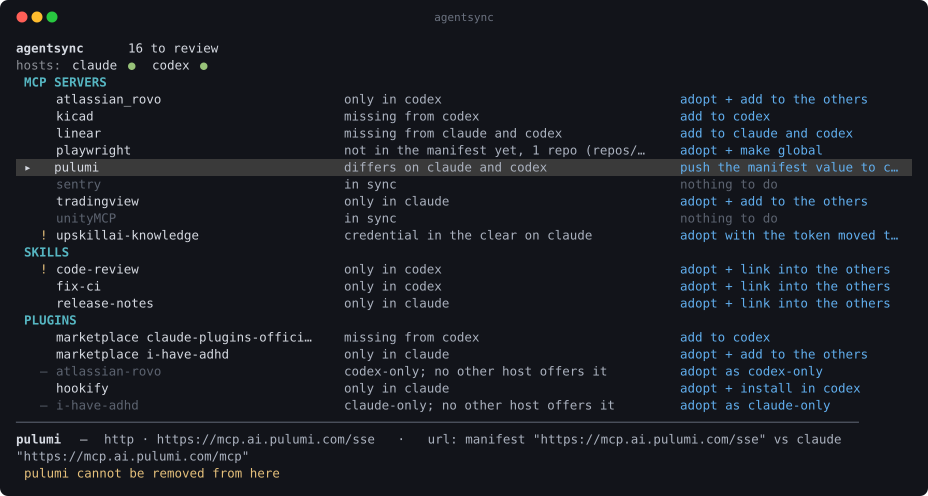
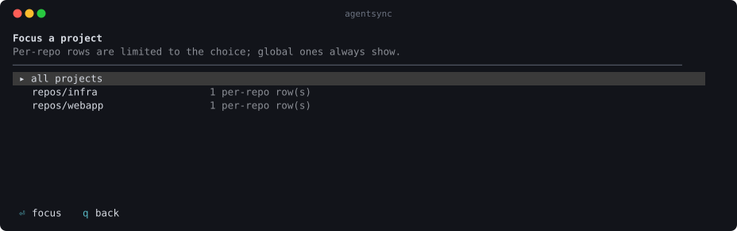
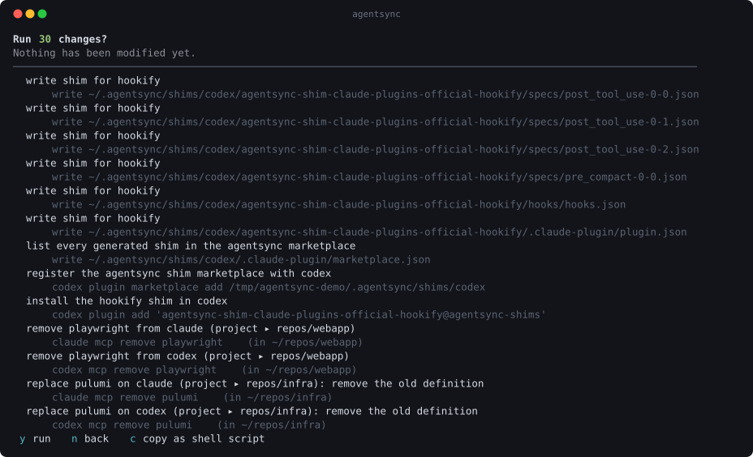
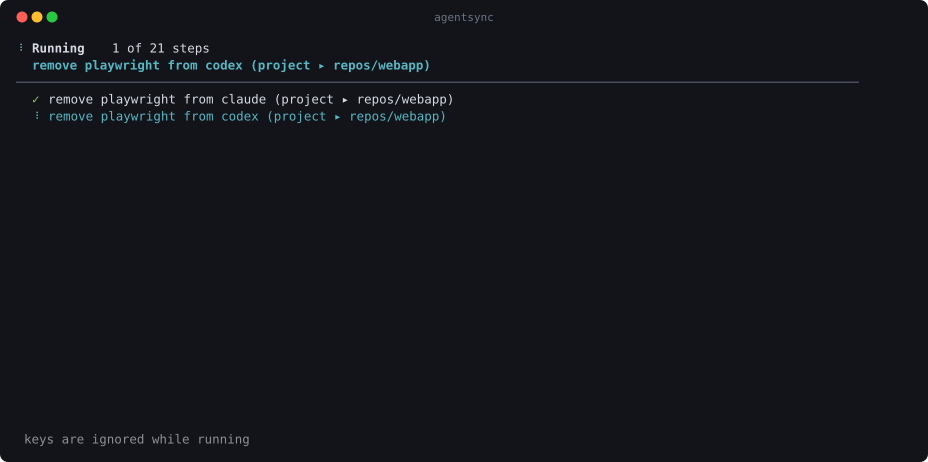
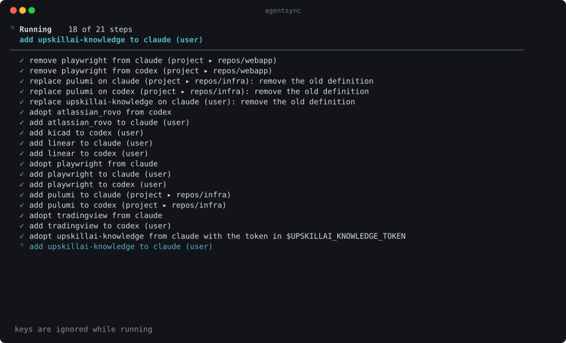

# agentsync

[](https://github.com/bydesign21/open-agent-sync/actions/workflows/ci.yml)

Keep your MCP servers, skills, instruction files, and plugins in sync across
agentic coding CLIs.

If you use more than one of Claude Code, Codex, and friends, your configuration
drifts. You add an MCP server in one and forget the other. `claude mcp add`
defaults to `--scope local`, so half your servers end up pinned to whichever repo
you happened to be in. A skill exists in one tool's directory and not the other.
Tokens end up sitting in plaintext in a JSON file.

`agentsync` shows you a to-do list of those differences and lets you resolve them
one keypress at a time.




## Install

### Prebuilt binary

One binary, no runtime dependency. Released for macOS (Apple Silicon and Intel),
Linux (x86_64 and arm64), and Windows (x86_64).

```sh
curl -fsSL https://raw.githubusercontent.com/bydesign21/open-agent-sync/master/install.sh | sh
```

That detects your platform, installs the latest release to `~/.local/bin`, and
**verifies the download against the release's `SHA256SUMS`** before installing
anything. `VERSION=v0.0.6` pins a version. `AGENTSYNC_BIN_DIR=/usr/local/bin`
changes where it lands.

Then:

```sh
agentsync --version
```

<details>
<summary>Or do it by hand, if you would rather not pipe a script into a shell</summary>

`uname -m` prints `arm64`/`aarch64` on Apple Silicon and arm, `x86_64` elsewhere.

```sh
VERSION=v0.0.6
REPO=https://github.com/bydesign21/open-agent-sync

case "$(uname -s)-$(uname -m)" in
  Darwin-arm64)   TARGET=aarch64-apple-darwin ;;
  Darwin-x86_64)  TARGET=x86_64-apple-darwin ;;
  Linux-aarch64)  TARGET=aarch64-unknown-linux-gnu ;;
  Linux-x86_64)   TARGET=x86_64-unknown-linux-gnu ;;
esac
ASSET="agentsync-$VERSION-$TARGET.tar.gz"

# Keep the published filename: SHA256SUMS refers to it by name, and renaming the
# download makes `shasum -c --ignore-missing` verify nothing and still exit 0.
curl -fsSLO "$REPO/releases/download/$VERSION/$ASSET"
curl -fsSLO "$REPO/releases/download/$VERSION/SHA256SUMS"
shasum -a 256 -c SHA256SUMS --ignore-missing

tar -xzf "$ASSET"
mkdir -p ~/.local/bin && mv agentsync ~/.local/bin/ && rm "$ASSET" SHA256SUMS
```

That must print `...tar.gz: OK`. Make sure `~/.local/bin` is on your `PATH`.

</details>

macOS quarantines a downloaded binary. The installer strips that for you. If you
installed by hand and it refuses to run:

```sh
xattr -d com.apple.quarantine ~/.local/bin/agentsync
```

On Windows, download `agentsync-v0.0.6-x86_64-pc-windows-msvc.zip` from the
[releases page](https://github.com/bydesign21/open-agent-sync/releases), extract
`agentsync.exe`, and put it somewhere on your `PATH`. The installer script does not
cover Windows and says so rather than half-working.

**Windows and symlinks:** the skills domain works by symlinking a canonical
directory into each host's skills directory. Creating a symlink on Windows
needs either Developer Mode (Settings → Privacy & security → For developers) or
an elevated terminal. Without one of those, skill rows fail with a message
saying so. The MCP and plugin domains are unaffected.

### From source with cargo

Needs Rust 1.88 or newer — the code uses let-chains, which are stable from 1.88 in
edition 2024. CI checks that against the `rust-version` in `Cargo.toml`, so it is
not a guess. `rustup` is the easy way to get it.

```sh
cargo install --git https://github.com/bydesign21/open-agent-sync --tag v0.0.6
```

Or from a clone, which is what you want if you plan to change anything:

```sh
git clone https://github.com/bydesign21/open-agent-sync
cd open-agent-sync
cargo install --path .
```

`cargo install` puts the binary in `~/.cargo/bin`.

### Building without installing

```sh
cargo build --release          # ./target/release/agentsync
cargo run -- plan              # run it in place, with arguments after --
```

To reproduce a release artifact for another target:

```sh
rustup target add x86_64-apple-darwin
cargo build --release --target x86_64-apple-darwin
```

The only platform-specific code is symlink creation, isolated in
`src/platform.rs`. Everything else — config paths, CLI invocation, the manifest —
is identical everywhere, because `dirs::home_dir` resolves `~` per platform and
both host CLIs take the same arguments.

## Use

```sh
agentsync              # the review TUI
agentsync plan         # print the differences and the plan the defaults would produce
agentsync apply --yes  # accept every default and run it
agentsync plan --only instructions   # or mcp, skills, plugins, hooks
agentsync doctor       # problems that are not differences: secrets, unset vars,
                       # dead paths, servers not logged in, and new releases
agentsync hosts        # what agentsync knows about each CLI
```

Rows that are already in sync are hidden — press `v` to see them. Nothing is
modified until you press `⏎`, review the exact commands, and confirm with `y`.
`c` on that screen writes the plan out as a shell script if you would rather run
it yourself.

`doctor`, the plan preview, and the host inventory are also reachable **from
inside the TUI** — `D`, `P`, and `H`. Being told to quit the interface to answer
"what is wrong with my setup?" is a bad answer. `?` lists every key. All of
those views scroll, and say `lines 12-31 of 145` so a screenful never passes for
the whole thing.

## The screens

Every image below is a real run, captured from a terminal. They use a demo
fixture — see [`docs/screenshots/`](docs/screenshots/) — so they stay stable and
cover the interesting states rather than whatever happens to be on one machine.

**Accepting rows.** `space` accepts one, `A` accepts a whole section, `e` cycles
the action. The count in the header tracks what is staged. Nothing has run yet.



**Removing things.** `v` reveals the rows that are in sync — dimmed, defaulting to
"nothing to do" so accept-all can never delete. `d` cycles the removal options,
and the detail line lists the per-host alternatives.



**Focusing a project.** `p` limits per-repo rows to one repo. Rows that are global
by nature stay visible.



**The plan gate.** `⏎` shows every step with the exact command it will run,
including the working directory for repo-scoped operations. Nothing has been
modified at this point. `c` exports it as a shell script.



**Running.** Progress streams as it goes: a spinner on the step in flight, a
count, and completed steps marked as they land. Keystrokes are discarded so
nothing typed while waiting fires afterwards.



**The result.** What was done, what failed with the host's own stderr, and what was
skipped — including steps you have to finish yourself, like exporting a token.



## How it works

**Read from config files, write through each CLI.** Host config files are parsed
directly, because that is complete and instant and reveals per-repo scopes the
CLIs hide behind the working directory. But every *change* is made by invoking
the host's own CLI. Those files hold state that is none of our business —
Codex's project trust levels, notice flags, model preferences. A tool that
takes ownership of the whole file destroys it.

**Instruction files are shared by default.** `CLAUDE.md` and `AGENTS.md` are both
plain markdown, so one canonical file in `~/.config/agentsync/prompts/` symlinks
into both — at user, project, and local scope. Shared is the default because most
of what goes in these files is about the *repo* (package manager, deploy gate,
conventions) rather than the tool. `hosts = [...]` is the opt-out for the parts
that genuinely name one CLI.

Two things it will not do. A scope a host has no location for — Codex has no
counterpart to `CLAUDE.local.md` — is reported, not given an invented path. And
when two hosts each already wrote their own file, there is no default: every offer
names whose version becomes canonical, because picking one silently discards the
other's wording.

**Memories are reported, never synced.** Claude Code keeps per-project notes under
a directory keyed by an encoded project path. Codex keeps its own in SQLite. There
is no file-level correspondence, so `doctor` says what exists and stops:

```
MEMORIES (reported, never synced)
  – claude: 64 note(s) across 8 project(s) under ~/.claude/projects — keyed by
    project path, so they do not transfer
  – codex: ~/.codex/memories_1.sqlite (40 KB) — SQLite, with no file-level
    counterpart on the other side
```

**Hooks are reported, not yet fixed.** A bash hook can carry an `if` guard, or
set `rewakeMessage` / `rewakeSummary`. Codex's hook config has no field for
any of them. Its own `trusted_hash` proves it: that hash covers only the command,
so five differently-guarded handlers hash identically once installed.
`agentsync plan --only hooks` names exactly which fields a target would drop.
It also blocks the row outright when the whole event has no counterpart on
that host (`PreCompact`, `SubagentStop`, `Notification`):

```
HOOKS
    security-guidance@claude-plugins-official:hooks/hooks.json:post_tool_use:1:0
      codex ignores if, rewake_message, rewake_summary  →  nothing to do
```

Nothing is generated to close the gap yet — a shim that emulates the dropped
fields on Codex is a separate, later plan.

**A canonical manifest, adopted from either side.** `~/.config/agentsync/manifest.toml`
records what you decided to keep. Symlink it into your dotfiles to version
it. You can adopt *into* it from any host, which matches how this actually goes:
you install something ad-hoc, then decide to keep it.

**Divergence is recorded, not nagged about.** Some things genuinely belong to one
tool. `hosts = ["codex"]` on an entry says so, and it stops being reported. That
is why the list converges to empty instead of training you to ignore it.

**Capabilities are enforced, not assumed.** `codex mcp add` has no `--header`, so
a server carrying custom HTTP headers is reported as *blocked* for Codex rather
than pushed with the headers silently dropped. Every skipped host prints why.

**It tells you when it is out of date, without ever waiting on the network.**
`doctor` asks GitHub for the newest release and prints the upgrade command. The
review screen shows only what that last check found, so it never makes a request
and never adds latency. A failed check reports as *unknown*, not as "up to date".
Set `AGENTSYNC_OFFLINE=1` to skip it entirely. The check shells out to `curl`
rather than linking a TLS stack — a version comparison is not worth an HTTP client
and the cross-compilation it complicates.

**A configured server is not a working server.** OAuth credentials are per-host
and do not travel with a definition. So pushing an OAuth-backed MCP server
writes a valid config entry that cannot connect until someone logs in.
agentsync emits the exact login command as a step you still have to run,
rather than reporting the add as done. `doctor` also asks each host which of
its servers actually hold
credentials — `codex mcp list --json` reports that. A config file cannot, because
it records *how* to authenticate, never whether the credential exists.

**Secrets are names, never values.** The manifest holds `bearer_token_env`,
`env_from`, and `${VAR}` references. A value that looks like a live credential is
rejected on save — a hard gate, not a lint, because the failure mode is a token in
git history. When agentsync finds a literal token in a host's config it offers to
move it to an environment variable rather than copying it.

**The run reports itself as it goes.** Executing a plan streams progress: a
spinner on the step in flight, a running count, and completed steps marked as they
land. Some steps are genuinely slow — a plugin install clones a repository — and a
UI that only repaints when everything is finished is indistinguishable from a
hang. Keystrokes during a run are discarded rather than queued, so nothing you
typed while waiting fires the moment the review screen returns.

**Failures do not abort the run.** Steps run in order. A failed step is recorded
and the run continues. The summary then says what was done, what failed with
the host's own stderr, and what was skipped. Stopping halfway would leave you
unable to tell which half landed. The manifest is written once at the end, and
only if every manifest edit succeeded.

**Nothing destructive happens without a backup.** Replacing a real directory with
a symlink, moving host-owned skill content into canonical storage, and deleting
canonical content all copy to `~/.config/agentsync/backups/` first. An "unlink"
action refuses to delete a real directory.

## Scopes

MCP servers exist at more than one scope, and the same name at two scopes is a
bug — one silently wins.

| Scope | Claude Code | Codex |
|---|---|---|
| `user` | `~/.claude.json` → `mcpServers` | `~/.codex/config.toml` → `[mcp_servers]` |
| `local` — this machine, one repo | `~/.claude.json` → `projects["<path>"].mcpServers` | — |
| `project` — committed, shared | `<repo>/.mcp.json` | `<repo>/.mcp.json` |

agentsync shows every scope in one list rather than making you switch between
them, collapses a name that appears in several repos into one row, and defaults a
shadowed entry to a single global definition. Promotion is the `adopt + make
global` action, which removes the per-repo copies before the global one lands so
the name is never at two scopes at once.

`p` focuses one project: per-repo rows are limited to it, while rows that are
global by nature (skills, plugins, user-scope servers) always stay visible —
hiding those would make the filter look like data loss. The picker offers every
repo under consideration: the manifest's, the current directory, anything
discovered in a host's per-repo config, and any passed with `--repo <path>`. A
repo with no agent configuration yet can only come from `--repo`, since there is
nothing to discover it by.

## Removing things

Every row can be removed, including rows that are in sync — otherwise the only way
to delete something would be to break it first. Press `d` to cycle the removal
options: all hosts, then each host individually.

Removing from *some* hosts narrows `hosts = [...]` in the manifest to whatever
remains. Without that the next run would report the entry as missing and offer to
put it straight back.

The default action on an in-sync row is always "nothing to do", so `A` and
`apply --yes` can never delete anything.

For skills the labels distinguish what is actually destroyed: unlinking a symlink
is trivially reversible, whereas removing a host's real directory when nothing
else holds the content destroys the only copy, and the action says so. Either way
the content is copied to `~/.config/agentsync/backups/` first.

## Adding another CLI

A host is a TOML descriptor. Drop one in `~/.config/agentsync/hosts/` — no
recompile, and it overrides a built-in of the same name.

```toml
name = "opencode"
display = "OpenCode"
detect = { bin = "opencode" }

[mcp]
scopes = ["user"]
caps = ["stdio", "http", "env", "bearer_env"]

[[mcp.read]]
file = "~/.config/opencode/config.json"
parser = "claude_json_v1"        # reuse a compiled parser

[mcp.add]
style = "flags"
argv_stdio = ["mcp", "add", "{name}", "{env_flags...}", "--", "{command}", "{args...}"]
argv_http  = ["mcp", "add", "{name}", "--url", "{url}", "{bearer_flags...}"]
env_flag = "--env"
env_format = "{key}={value}"
bearer_env_flag = "--bearer-token-env-var"

[mcp.remove]
argv = ["mcp", "remove", "{name}"]

[skills]
dirs = ["~/.config/opencode/skills"]   # dirs[0] is the link target
```

Config *parsing* stays compiled — `parser = "..."` names one of a handful of
shapes, listed by `agentsync hosts --parsers`. Config formats are too irregular
to describe in data, but a new host usually reuses an existing parser. Everything
else — paths, argv, flag spellings, scopes, capabilities — lives in the file.

`caps` is what makes this safe: declare only what the CLI can actually express,
and agentsync refuses to push anything it cannot express, instead of dropping the
part that does not fit.

Template vocabulary: `{key}` substitutes a scalar anywhere in an argument (an
unknown key is an error, never an empty string), and an argument that is exactly
`{key...}` splices a list and may expand to nothing.

## Manifest

```toml
[mcp.kicad]
transport = "stdio"
command = "node"                     # bare, so it resolves on another machine
args = ["~/repos/kicad-mcp/dist/index.js"]
env = { LOG_LEVEL = "info" }
env_from = ["KICAD_PYTHON"]          # forwarded by name. The value is never stored

[mcp.knowledge]
transport = "http"
url = "https://api.example.com/mcp"
bearer_token_env = "KNOWLEDGE_TOKEN"

[mcp.pulumi]
transport = "stdio"
command = "pulumi"
args = ["mcp", "start"]
scope = "project"
repos = ["/Users/me/repos/infra"]

[mcp.unityMCP]
transport = "http"
url = "http://127.0.0.1:8080/mcp"
hosts = ["codex"]                    # intentional divergence, recorded

[skills.code-review]
source = "skills/code-review"        # relative to the manifest

[instructions.user]
source = "prompts/user.md"           # → ~/.claude/CLAUDE.md and ~/.codex/AGENTS.md

[instructions.core-infra]
source = "prompts/core-infra.md"
scope = "project"                    # → <repo>/CLAUDE.md and <repo>/AGENTS.md
repos = ["/Users/me/repos/core/infra"]

[instructions."core-infra.local"]
source = "prompts/core-infra.local.md"
scope = "local"
repos = ["/Users/me/repos/core/infra"]
hosts = ["claude"]                   # Codex has no CLAUDE.local.md equivalent

[marketplaces.claude-plugins-official]
github = "anthropics/claude-plugins-official"
hosts = ["claude"]

[plugins.superpowers]                # no marketplace: resolved per host
```

Plugin ids are derived rather than declared, because the curated registries
genuinely differ between hosts. `superpowers` is in `claude-plugins-official` on
Claude Code and three different marketplaces on Codex, and plenty of plugins are
in only one. Neither CLI resolves a bare id (`codex plugin add superpowers` exits
1 with "requires --marketplace unless passed as `<plugin>@<marketplace>`"). So
agentsync reads each host's marketplace manifests and resolves the id per host.
A name no marketplace offers is *not available*, not drift. A name several
marketplaces offer asks you to pin one rather than guessing.

A per-repo `.agentsync.toml` is merged in for that repo, forced to project scope.
It never shadows the user manifest silently — a name collision is reported.

## Layout

```
tui/        review + run screens
core/       model, differ, planner, applier — no host knowledge
domains/    mcp, skills, instructions, plugins, hooks
hosts/      descriptor loader, parser registry, CLI runner
manifest/   canonical file + secret gate
```

`core` takes a manifest and a list of host snapshots and emits rows and a plan. It
has never heard of Claude Code or Codex. That is what keeps hosts pluggable and
the differ testable without a machine to test against.

## Development

The full gate, which is exactly what CI runs — on macOS, Linux, and Windows:

```sh
cargo fmt --check
cargo clippy --all-targets -- -D warnings
cargo test
```

CI additionally checks that the code really does build with the `rust-version`
declared in `Cargo.toml`, so the MSRV is a measurement rather than a claim.

`tests/diff.rs` builds synthetic worlds and asserts on row wording and planner
output. `tests/apply_e2e.rs` stands up a fake host CLI on a temporary `PATH`. It
records the argv it receives and maintains a real config file. So the write path
is verified without touching the machine running the tests, including that a
second pass converges.

`cargo test` alone is not enough to trust a change here, because most of the risk
is in what gets handed to another program's CLI. When touching a host descriptor,
also check the argv it produces:

```sh
agentsync plan          # every step prints the exact command it will run
```

### Cutting a release

Set `version` in `Cargo.toml` equal to the tag — so `agentsync --version` and the
release you downloaded agree — then push the tag:

```sh
git tag v0.0.6 && git push origin v0.0.6
```

`.github/workflows/release.yml` builds all five targets, packages them, writes
`SHA256SUMS`, and publishes. It is idempotent: re-running a tag replaces its
assets. `workflow_dispatch` rehearses the build without publishing.

`install.sh` reads the latest release from the API, so it needs no change per
version. The `VERSION=` examples in this README do, and the one-liner is served
from `master` rather than a tag — a fix to the installer reaches people without a
release.

## Status

Early. Verified against Claude Code 2.1.220 and Codex CLI 0.146.0 on macOS
(Apple Silicon). Every capability claim in the built-in descriptors was checked
against the CLIs' own `--help` output rather than assumed — see the comments in
`src/hosts/builtin/*.toml`.

Known gaps:

- Codex's project-scoped `.mcp.json` support is inferred from its loader strings,
  not confirmed. Its descriptor declares `scopes = ["user"]` until it is. Claude
  Code's three scopes are confirmed against `claude mcp add --help`.
- `agentsync doctor --fix`, to rewrite a literal secret out of a host's own config
  file, is not implemented. Today, moving a token to an environment variable
  rewrites the manifest and re-pushes the corrected definition. The old literal
  survives in the backup.
- Whether Claude Code expands `${VAR}` inside `headers` at **user** scope (as
  opposed to a project `.mcp.json`) is unverified. If it does not, a bearer token
  moved to an environment variable will be sent literally. Check with
  `claude mcp list` after applying such a change.
- Only tested by hand against the real Claude Code and Codex on macOS. CI proves
  the code builds and its own tests pass on all three platforms, but the host
  descriptors' paths and capabilities are verified against the macOS CLIs.

## License

MIT
